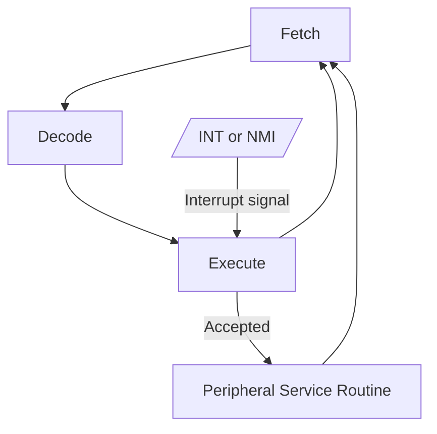
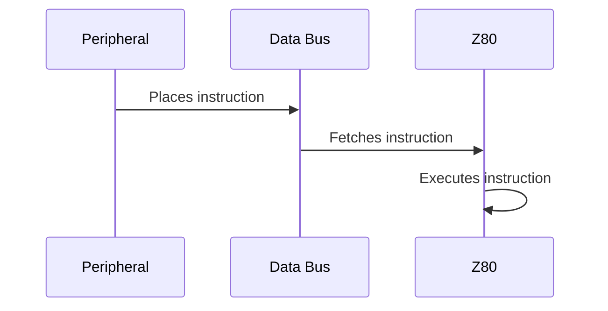
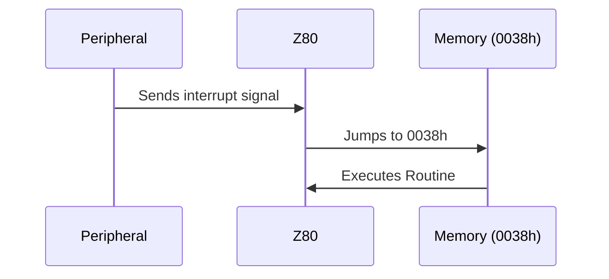
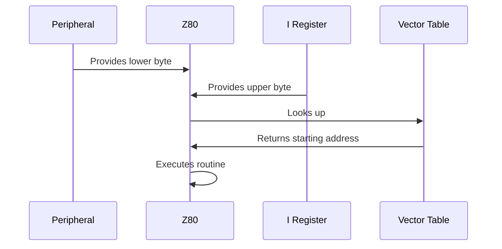

# 2026/03/10 Tue

## Computer Science

- 割り込みとは
  - CPUが周辺装置とやりとりするために必要
  - 周辺装置はCPUに用があるときに割り込む
  - もしも割り込みがなかったら、CPUは命令の合間に周辺装置を調べたり、周辺装置からのデータがなければ計算実行、のような非効率な作りにせざるを得ない
  - [Z80CPUを知りたい その10｜hon](https://note.com/genial_snipe3018/n/n8bbffbf10243)
  - [電子計算機工学 II](https://edu.isc.chubu.ac.jp/naga/Z80/Z802c.html)
- 拒否できる割り込みと拒否できない割り込みがある
  - NMI（Non Maskable Interrupt）
    - 拒否できない。CPUは必ず処理する
    - 電源障害やメモリエラーなど重要性の高いもの
  - INT（INTerrupt）
    - 設定によって無視できる
    - 通常のマウスやキーボード入力など
- Z80の割り込みモードは0, 1, 2
  - モード0：周辺装置からの命令自体をデータバスから取得し、実行する
  - モード1：割り込み処理のルーチンは0038h番地に固定されており、そこにジャンプする
  - モード2：Iレジスタの値、周辺装置から送られてきたデータを組み合わせてアドレスを特定し、そのアドレスに格納されたアドレスにジャンプする
  - [Z80 CPU User Manual](https://www.zilog.com/docs/z80/um0080.pdf)

- ヘテロジニアスコンピューティング
  - 異なる種類のプロセッサを組み合わせたコンピュータシステム
  - [ヘテロジニアス・コンピューティング - Wikipedia](https://ja.wikipedia.org/wiki/%E3%83%98%E3%83%86%E3%83%AD%E3%82%B8%E3%83%8B%E3%82%A2%E3%82%B9%E3%83%BB%E3%82%B3%E3%83%B3%E3%83%94%E3%83%A5%E3%83%BC%E3%83%86%E3%82%A3%E3%83%B3%E3%82%B0)
