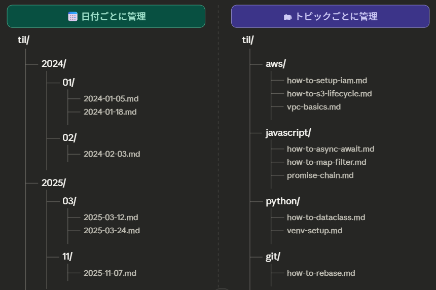
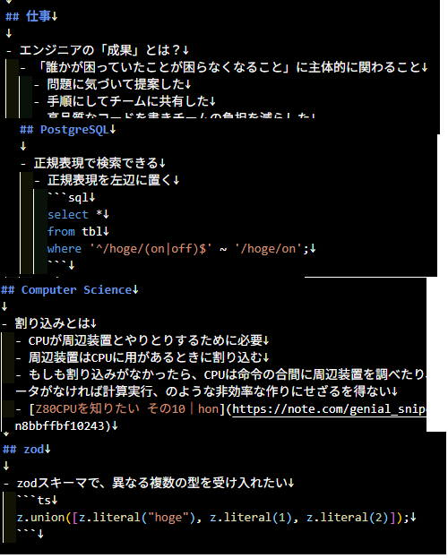
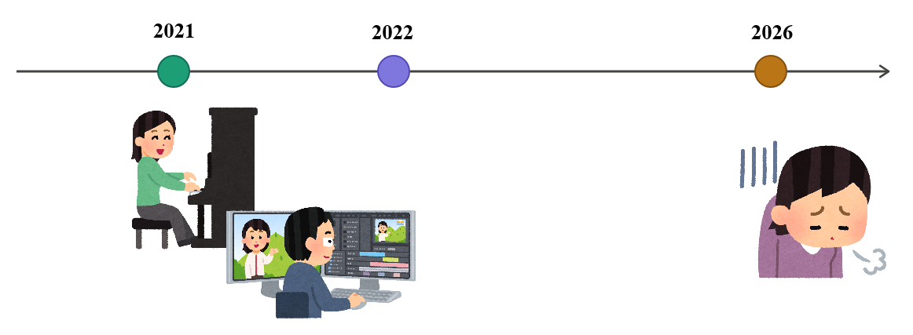

<!-- _class: title　-->
<!-- _paginate: false -->

# いまさらTILをはじめてみた

<!--
今回のテーマ「最近やってみたこと」ということで、いまさらTILを始めてみた話をしたいと思います。
よろしくお願いします。
-->

2026/03/26

---

<!-- _class: content-image-left content-60 -->

# 自己紹介

- 加藤　由華
- 製造ビジネステクノロジー部
- バックエンドエンジニア
- 名古屋オフィス所属

<!--
私は製造ビジネステクノロジー部に所属しております加藤と申します。
普段はこの名古屋オフィスに出社しています。
主にTypeScriptでバックエンドの領域を担当しています。
-->

---

<!-- _class: no-header all-text-center align-center -->

# TILとは

<!--
早速ですがTILをご存じでしょうか
-->

---

<!-- _class: no-header all-text-center align-center -->

# Today I Learned

<!--
TILはToday I Learnedの略称で今日学んだことを意味します
-->

---

<!-- _class: content-image -->

# TIL（Today I Learned）

- その日学んだことを毎日記録していく習慣
- エンジニアコミュニティで昔からある文化
- GitHubのMarkdownファイルで管理するのが定番

<!--
その名の通り、今日学んだことをひたすら記録していく習慣のことを指します。
で、これは特に目新しいものというわけではなくて、エンジニア界隈で10年ぐらい前からある文化です。
学んだことをMarkdownで書いてGitHubで管理するというのが定番となっています。
ここまで聞いて自分用メモと何が違うのかと思われたかもしれませんが、要するに自分用メモです。自分用メモをMarkdownにしてGitHubに上げているというだけです。
GitHubをTILとかで検索するとこれをやっているリポジトリがたくさん見つかって、人のを見ているのも結構楽しめたりするんですが、
派閥としては日付ごとに管理する人と、技術ごとに管理する人がいるようです。
日付ごとの場合は、日ごとのファイルを作成して、その日学んだことを記録していく。
技術ごとの場合は、画面にありますようにawsとかjavascriptとか技術ごとにフォルダを作成して、how to setup iamとか学んだことごとにファイルを作って記録していくといった感じになります。
私は、最初からカチッとルールを決めすぎると続かないタイプなので、これはどこに分類しようかとか考えず雑多に書いていきたかったので、日付ごとに管理することにしました。
-->

---

<!-- _class: content-image-right -->

# こんなことを書いている

- 以下のマイルールを設定
  - 新たな学び、気づき、発見を記録する
  - しょうもないことでもOK
  - 業務の文脈に特化したものは、汎化して記載する
  - 業務情報、機密情報は記載しない

| カテゴリ     | 例                                                      |
| ------------ | ------------------------------------------------------- |
| 基礎知識     | CPUアーキテクチャ、割り込み処理、アセンブリ言語         |
| 技術のTips   | PostgreSQLの正規表現検索、Zodの定義方法、エラー解決方法 |
| ツールのTips | GitHub Actions承認フロー、VS Codeの設定                 |
| 仕事全般     | エンジニアの成果定義                                    |
| その他       | 心理学、健康情報                                        |

<!--
では実際の私の例なんですが
TILを始めるにあたり、いくつかマイルールを作りました。
この中でしょうもないことでもOKというのが一番重要で、自分用メモとはいえ「こんなこと書いてもいいのか」みたいな迷いをなくしてとにかく心理的ハードルを下げたかったのでこのようなルールにしています。
どんなことを書いているかというと今まで書いたことを大きく分けるとコンピュータの基礎知識だったり、技術やツールのTIPS、仕事全般に関すること、あとは全然業務と関係ないですが心理学や健康情報などもたまに書いたりしています。
で、右側の画像が実際に今まで書いたことを抜粋したものです。
-->

---

<!-- _class: no-header all-text-center align-center -->

# なぜやろうと思ったのか

<!--
ではなぜやろうと思ったのかということですが
-->

---

<!-- _class: no-header all-text-center align-center -->

# 日々の積み重ねを可視化するため

<!--
一言でいうと日々の積み重ねを可視化したかったからです
-->

---

# 日々の積み重ねを可視化する

- **成長しているはずなのに、何をやったか覚えていない**
  - 大きな学び、トラブルはブログなどでアウトプットできる
  - でも毎日大きなネタばかりあるわけではない
  - 日々の小さく地味な学びはすぐ忘れてしまう

### →学びを気軽に記録して、積み重ねを可視化したい

<!--
日々業務に追われていると、自分が成長したかどうかわからなくなってくることが私はよくあります。
日々の業務するで、何か新しいことを学んだり、できるようになっていることがあるはずなのに、いざ思い返すとあれ？何ができるようになったんだっけ？となってしまうことがあります。
で、個人的には、大きな学びとか、トラブルとかは、あ、これブログネタになるぞみたいな感じでアウトプットのモチベーションになるんですが、別に毎日毎日大きなネタばかりあるわけではないです。
どちらかというと日々の業務は小さくて地味な学びの繰り返しだと思っていまして、でもそういうことってすぐに記憶から抜け落ちてしまうと私は感じています。
なのでもっと気軽に、小さなことでもアウトプットを蓄積して、学びや成長を可視化したいというのが始めようと思ったきっかけです。
-->

---

<!-- _class: no-header all-text-center align-center -->

# 「気軽に」がポイント

<!--
で、気軽にというのがポイントだと思っています
-->

---

# 気軽にアウトプット

- アウトプットが続かない理由
  - 「ちゃんとしたものを書かないと」というプレッシャー
- TILは自分用メモ
  - 断片的な情報や、真偽不明なままでもOK
  - 日本語が崩れていてもOK

<!--
アウトプットしたいと思いつつなかなか続かないということがあると思います。
やっぱりアウトプットっていうと身構えてしまって、ちゃんとしたネタじゃないととか、公式ソースで確認しないととか、ちゃんとしたものを出さないとというプレッシャーを感じて、結果的に手が止まってしまうというのはありがちなパターンかなと思います。
TILはGitHubリポジトリにあるというだけのただの自分用メモなので、そのハードルが全部なくなります。
断片的なことや、公式ソースが確認できていない真偽不明な情報を書いても誰にも怒られないですし、日本語も最悪自分がわかれば適当でも問題ないです。
この気軽さが一番のメリットかなと思っています。
-->

---

<!-- _class: no-header all-text-center align-center -->

# AI時代だからこそ価値がある

<!--
でTILは昔からある文化なんですけど、AI時代の今だからこそ価値があるのではないかと私は思っています。
-->

---

<!-- _class: no-header all-text-center align-center -->

# AIはTILの蓄積をもとにして働いてくれる

<!--
なぜかというと、TILの蓄積したデータをもとに、AIを使って色々できるからです
-->

---

# TIL×AI活用例

- TILを元にLTの内容を考えてもらう
- ブログネタになりそうなものを見つけてもらう
- 学習状況の分析
  - 「ｘｘについて他にどんなことを学べばいい？」「理解が浅そうなトピックは？」
- 1on1や報告用のサマリー
  - 「今週の学びを3行でまとめて」
- 過去の調査を再利用
  - 「以前ｘｘで詰まったことがある？どう解決した？」

<!--
具体的には、私が思いつく限りですが、このTILのデータとAIを組み合わせて、例えばこんなことができます。
過去に書いた中からブログやLTのネタを考えてもらったり、学習状況を分析、例えばこのトピックについて何が足りてないですかとか聞いたり
あとは1on1や報告用に3行でまとめてとか、また過去に同じようなトラブルがあったときはどう解決したかをAIに聞くことができます。
こういうのって、なかなか人間が過去のファイルを全部検索するのは大変だと思うんですが、AIを使えばそのあたりは全部やってくれるので、今だからこそこういった情報の蓄積は価値が出てくると思っています。
-->

---

<!-- _class: no-header all-text-center align-center -->

# 突然ですが趣味のピアノの話をします

<!--
突然ですが趣味のピアノの話をします
-->

---

<!-- _class: image -->

# 趣味のピアノでの教訓

<!--
私は2021年頃に子供のころ習っていたピアノを再開し、2022年ぐらいまでは練習した曲を動画に撮って残していました。
で、その後なんやかんや忙しかったりで、ピアノは続けていたものの動画を撮るのはやめてしまいました。
最近、練習があまりできていなかったり発表会でズタボロになるということが続いていて、自分はなんてピアノが下手なんだ。自分は昔から練習もサボリがちでまともに弾けたためしがない。と自信をなくしていたんですよね。
で、あるときたまたま昔の演奏動画を見たんですよね。
そしたら、結構弾けてたんですよね。
え、こんなに自分弾けてたんだとびっくりしたんですが、
思い返せば、動画を撮っていた頃は毎日練習していましたし、間違えがちな部分は何度も何度も繰り返し練習していたりしました。
でも、そのことを動画を見るまで忘れていたんですよね。
それで、自分は昔から練習もまともにできないだめなやつだと勝手に過去を捏造して、勝手に落ち込んでいたんですよね。
人は自分が経験したことでも簡単に忘れてしまうんだなと思いまして
逆にこの空白の4年間は何も残っていないのでもう思い出せないんですよね。
なので記録を残しておくっていうのは非常に重要だなと思いました。
-->

---

<!-- _class: no-header all-text-center align-center -->

# AIにより、今この瞬間の能力はブーストできる

<!--
で、今AIってなんでもやってくれます。
一瞬でコードを書いてくれたり、一瞬で調べ物も、資料作成もしてくれます。
AIを使えば、今この瞬間の能力は大幅にブーストできます
-->

---

<!-- _class: no-header all-text-center align-center -->

# しかし、歴史は改ざんできない

<!--
でも、歴史、自分の経験や積み重ねてきたこと、努力してきたことは改ざんできません。
-->

---

<!-- _class: no-header all-text-center align-center -->

# 小さなアウトプットでも積み重ねたものは残る

<!--
なので、たとえ小さなアウトプットであっても積み重ねていけば、いつか何かの役に立つかもしれない
それがTILを始めてみて感じたことで、続けるモチベーションになっています。
以上です。ご清聴ありがとうございました
-->

---

<!-- _class: all-text-center align-center -->

